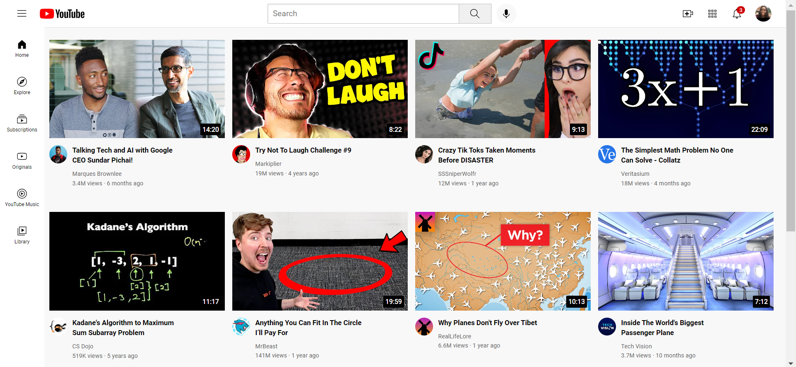

# YouTube

## Welcome! 👋
Thank you for checking out my Repository

## Project Description

This project is a YouTube Home page built using just HTML, and CSS for the styling following a tutorial by SupersimpleDev on YouTube [Supersimpledev](https://www.youtube.com/watch?v=G3e-cpL7ofc&t=8373s). 

## Built with
- Semantic HTML5 markup
- CSS custom properties
- Flexbox
- CSS Grid